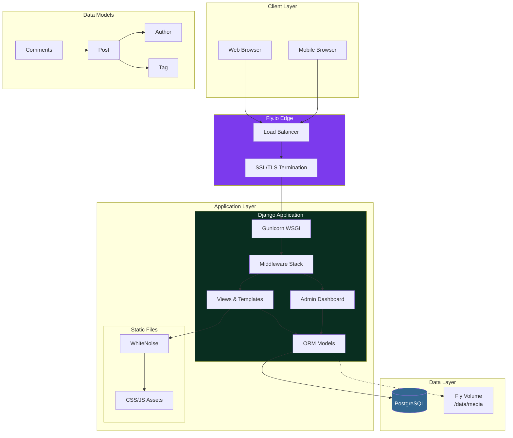
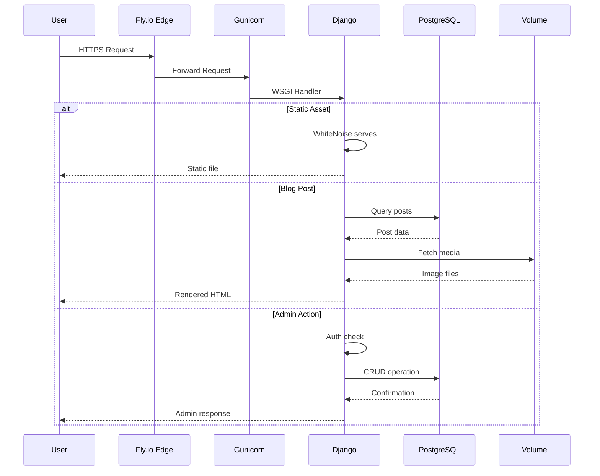

# Eric Gitangu's Tech Blog


<div align="center">
    <a href="https://developer.ericgitangu.com">
        
        <h2>Eric Gitangu</h2>
    </a>

A Django-powered blog showcasing insights in technology, AI, systems architecture, cybersecurity, and software development.

**Live:** [blog.ericgitangu.com](https://blog.ericgitangu.com)

</div>

---

## Features

- **Dynamic Content Management**: Built-in Django admin interface for content creation
- **Fly.io Deployment**: Production hosting with PostgreSQL and persistent volumes
- **Production-Ready Security**: HTTPS, HSTS, secure cookies, and CSRF protection
- **PostgreSQL Database**: Robust data storage with connection pooling
- **WhiteNoise Static Files**: Compressed and cached static file serving
- **Console Logging**: Streamlined logging for fly.io log aggregation

## Tech Stack

| Category | Technology |
|----------|------------|
| **Framework** | Django 5.1 |
| **Language** | Python 3.11 |
| **Database** | PostgreSQL (Fly Postgres) |
| **Static Files** | WhiteNoise |
| **Media Storage** | Fly Volumes |
| **Server** | Gunicorn |
| **Deployment** | Fly.io |

## Architecture



### Component Interaction Flow



## Local Development

### Prerequisites
- Python 3.11+
- PostgreSQL (or use SQLite for local dev)

### Setup

```bash
# Clone the repository
git clone https://github.com/ericgitangu/blog.git
cd blog

# Create virtual environment
python -m venv venv
source venv/bin/activate  # On Windows: venv\Scripts\activate

# Install dependencies
pip install -r requirements.txt

# Set environment variables
export SECRET_KEY="your-secret-key"
export DEBUG="True"
export DBNAME="blog_dev"
export DBUSER="postgres"
export DBPASS="password"
export DBHOST="localhost"
export DBPORT="5432"

# Run migrations
python manage.py migrate

# Create superuser
python manage.py createsuperuser

# Run development server
python manage.py runserver
```

## Deployment to Fly.io

### Prerequisites
- [Fly CLI](https://fly.io/docs/hands-on/install-flyctl/)
- Fly.io account

### Deploy

```bash
# Authenticate
fly auth login

# Create app and Postgres
fly apps create deveric-blog
fly postgres create --name deveric-blog-db --region iad
fly postgres attach deveric-blog-db --app deveric-blog

# Create volume for media files
fly volumes create blog_data --region iad --size 1 --app deveric-blog

# Set secrets
fly secrets set SECRET_KEY="$(python -c 'from django.core.management.utils import get_random_secret_key; print(get_random_secret_key())')" --app deveric-blog
fly secrets set DEBUG="False" --app deveric-blog

# Deploy
fly deploy --app deveric-blog

# Create superuser
fly ssh console --app deveric-blog
python manage.py create_superuser --username egitangu --email admin@ericgitangu.com --password yourpassword
```

### Custom Domain

```bash
fly certs add blog.ericgitangu.com --app deveric-blog
fly ips list --app deveric-blog
# Add A/AAAA records in your DNS provider
```

## Project Structure

```
blog/
├── blog/                 # Django project settings
│   ├── settings.py       # Configuration (Fly.io aware)
│   ├── urls.py           # URL routing
│   └── wsgi.py           # WSGI entry point
├── portfolio/            # Main blog app
│   ├── models.py         # Post, Author, Tag, Comments
│   ├── views.py          # ListView, DetailView
│   ├── admin.py          # Admin customization
│   └── templates/        # HTML templates
├── Dockerfile            # Multi-stage production build
├── fly.toml              # Fly.io configuration
└── requirements.txt      # Python dependencies
```

## Security

- HTTPS enforced via Fly.io
- HSTS with 1-year max-age
- Secure session and CSRF cookies
- Password validation policies
- XFrame options protection

## Connect

- **Portfolio**: [developer.ericgitangu.com](https://developer.ericgitangu.com)
- **LinkedIn**: [linkedin.com/in/ericgitangu](https://linkedin.com/in/ericgitangu)
- **GitHub**: [github.com/ericgitangu](https://github.com/ericgitangu)
- **Blog**: [blog.ericgitangu.com](https://blog.ericgitangu.com)

## License

This project is licensed under the MIT License.
